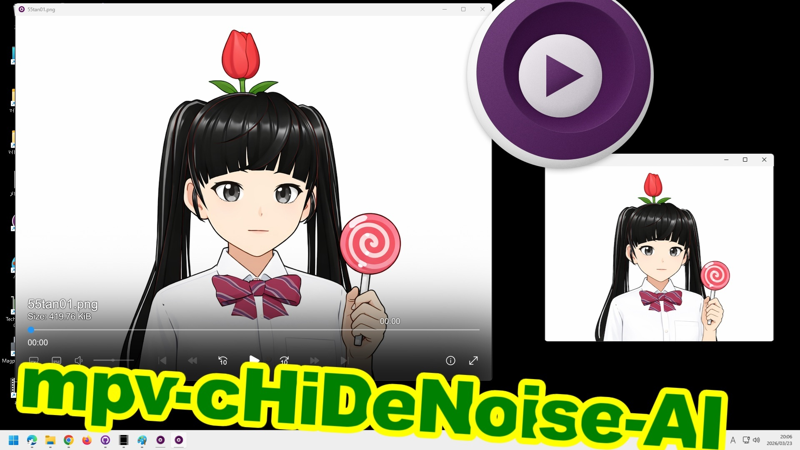

mpv-cHiDeNoise-AI
---
リアルタイム処理で高画質な再生を楽しめるmpv（[mpv-lazy](https://github.com/hooke007/mpv_PlayKit)）ベースの派生版AI再生プレーヤーです。（windows11）

onnxを使用したAIアップスケーリング、フレーム補間、Anime4KなどのGLSLシェーダー、vapoursynthフィルターなど多種多様なツールを搭載。

独自の [ウィンドウキャプチャ](https://www.youtube.com/watch?v=xrgJoh29bpM) / [外部入力キャプチャ機能](https://youtu.be/Cnx0tj_a4UQ?si=720YPOgsZ9lfGc9s)、[VSRのonnx対応](https://youtu.be/A4qxclRe3IU?si=IZfu81p-jKr19jVa) などにより様々な映像ソースが高画質で視聴可能になります。

本リポジトリは、「mpv-cHiDeNoise-AI」関連の自作ファイルや編集済みファイルを GitHub 上で管理するための個人用リポジトリです。

紹介動画
---

参考プロジェクト / 謝辞
---
本リポジトリの構築・調整にあたり、以下のプロジェクトや関連する制作者・貢献者の方々を参考にさせていただきました。ここに敬意と感謝を表します。

- [mpv_PlayKit (hooke007)](https://github.com/hooke007/mpv_PlayKit)
- [vs-mlrt (AmusementClub)](https://github.com/AmusementClub/vs-mlrt)
- [vs_temporalfix (pifroggi)](https://github.com/pifroggi/vs_temporalfix)
- [vapourkit (Kim2091)](https://github.com/Kim2091/vapourkit)
- [Magpie (Blinue)](https://github.com/Blinue/Magpie)
- [OpenModelDB](https://openmodeldb.info/)

> [!IMPORTANT]
>参考元、謝辞、ライセンス・出所整理に関する補足および利用上の注意や免責事項については `NOTICE.txt` を参照してください。

このリポジトリは mpv-cHiDeNoise-AI 関連ファイルの管理用であり、クローンしただけで配布版アプリ全体がそのまま再現される構成ではありません。完成版の配布については Releases および外部配布リンクを参照してください。

また、本リポジトリは個人のペースで管理・更新しております。派生物や個別利用に関する対応・サポートは行っておりません。